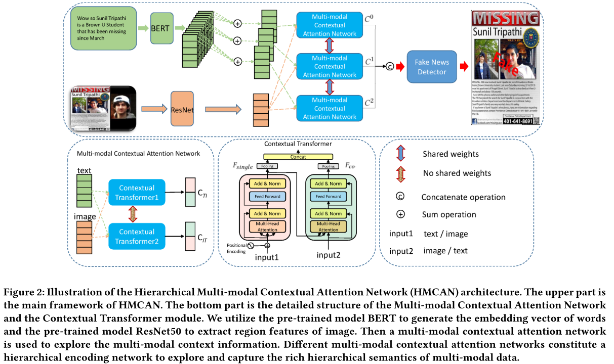

# Hierarchical Multi-modal Contextual Attention Network for Fake News Detection

This is the source code of SIGIR 2021 paper [Hierarchical Multi-modal Contextual Attention Network for Fake News Detection](https://arxiv.org/abs/2103.00113) (HMCAN). 




## Requirments
This code requires the following:
* Python>=3.6
* PyTorch>=1.7.0
* Numpy>=1.19.2
* Scipy>=1.5.4
* Scikit-learn>=0.24.2

## Datesets
* [TWITTER](https://github.com/MKLab-ITI/image-verification-corpus/tree/master/mediaeval2015)

## Running the experiments
### Twitter
```
python train_demo.py -c configs/twitter.yaml
```

## Cite

If you compare with, build on, or use aspects of HMCAN framework, please cite the following:
```
@inproceedings{qian2021hierarchical,
  title={Hierarchical multi-modal contextual attention network for fake news detection},
  author={Qian, Shengsheng and Wang, Jinguang and Hu, Jun and Fang, Quan and Xu, Changsheng},
  booktitle={Proceedings of the 44th International ACM SIGIR Conference on Research and Development in Information Retrieval},
  pages={153--162},
  year={2021}
}
```
